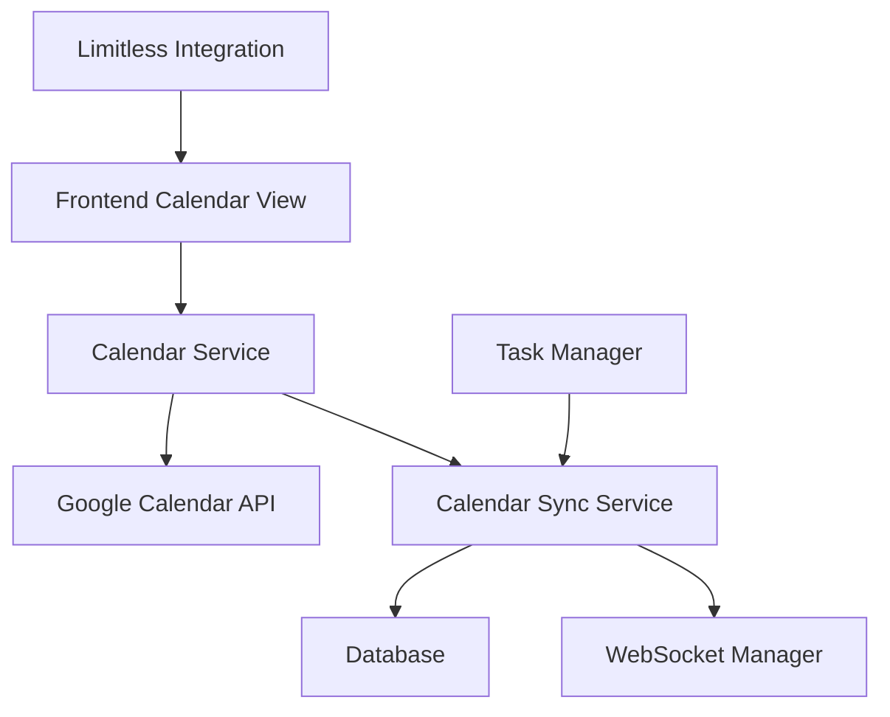

# Google Calendar Integration Specification

## Overview
This document outlines the implementation of bidirectional Google Calendar synchronization for CCOPINAI, including OAuth authentication, event synchronization, and task management integration.

## Requirements

### Core Features
1. **OAuth 2.0 Authentication** with Google Calendar API
2. **Bidirectional Calendar Sync**:
   - Import Google Calendar events to CCOPINAI
   - Export CCOPINAI events to Google Calendar
3. **Limitless.ai Integration**: Overlay Limitless.ai content with calendar events
4. **Controlled Modifications**: Only modify/delete CCOPINAI-created events in Google Calendar
5. **Task Synchronization**: Sync tasks and activities between systems
6. **Real-time Updates**: WebSocket-based real-time sync notifications

### Security & Privacy
- Secure OAuth token storage with encryption
- User consent for calendar access
- Granular permission controls
- Data isolation per user

## Architecture

### Components


### Database Schema
- `user_calendar_tokens`: Store encrypted OAuth tokens
- `calendar_events`: Local event storage with Google Calendar mapping
- `calendar_sync_state`: Track synchronization status
- `calendar_tasks`: Task management integration

### API Endpoints
- `POST /calendar/auth/google` - Initiate OAuth flow
- `GET /calendar/auth/callback` - Handle OAuth callback
- `POST /calendar/sync` - Manual sync trigger
- `GET /calendar/events` - Get user's calendar events
- `POST /calendar/events` - Create new event
- `PUT /calendar/events/{id}` - Update event
- `DELETE /calendar/events/{id}` - Delete event

## Implementation Plan

### Phase 1: Authentication & Basic Sync
1. Google OAuth 2.0 setup
2. Token management service
3. Basic event import/export
4. Database schema implementation

### Phase 2: Advanced Features
1. Bidirectional synchronization
2. Conflict resolution
3. Real-time updates
4. Task integration

### Phase 3: Integration & Polish
1. Limitless.ai overlay
2. UI enhancements
3. Error handling
4. Performance optimization

## Google Calendar API Setup

### Required Scopes
- `https://www.googleapis.com/auth/calendar` - Full calendar access
- `https://www.googleapis.com/auth/calendar.events` - Event management

### OAuth 2.0 Flow
1. User clicks "Connect Google Calendar"
2. Redirect to Google OAuth consent screen
3. User grants permissions
4. Google redirects to callback with authorization code
5. Exchange code for access/refresh tokens
6. Store encrypted tokens in database

## Data Models

### Calendar Event
```typescript
interface CalendarEvent {
  id: string;
  google_event_id?: string;
  user_id: string;
  title: string;
  description?: string;
  start_time: string;
  end_time: string;
  all_day: boolean;
  location?: string;
  attendees?: string[];
  source: 'ccopinai' | 'google' | 'limitless';
  sync_status: 'pending' | 'synced' | 'conflict' | 'error';
  created_at: string;
  updated_at: string;
}
```

### Calendar Task
```typescript
interface CalendarTask {
  id: string;
  user_id: string;
  title: string;
  description?: string;
  due_date?: string;
  completed: boolean;
  source: 'ccopinai' | 'limitless';
  calendar_event_id?: string;
  created_at: string;
  updated_at: string;
}
```

## Synchronization Strategy

### Import Strategy
1. **Full Sync**: Import all events from user's primary calendar
2. **Incremental Sync**: Use `updated_min` parameter for changed events
3. **Conflict Resolution**: Last-modified-wins with user override option

### Export Strategy
1. **CCOPINAI Events**: Create events in user's primary calendar
2. **Event Marking**: Add special identifier in description to mark CCOPINAI-created events
3. **Controlled Deletion**: Only delete/modify events with CCOPINAI identifier

### Limitless.ai Integration
1. **Calendar Overlay**: Show Limitless meetings/calls in calendar view
2. **Event Enhancement**: Add Limitless context to calendar events
3. **Smart Scheduling**: Suggest meeting times based on Limitless data

## Error Handling

### Common Scenarios
- OAuth token expiration/revocation
- Google Calendar API rate limits
- Network connectivity issues
- Sync conflicts
- Invalid event data

### Recovery Strategies
- Automatic token refresh
- Exponential backoff for rate limits
- Offline queue for failed operations
- User notification for conflicts
- Data validation and sanitization

## Security Considerations

### Token Management
- Encrypt tokens at rest using AES-256
- Secure token transmission via HTTPS
- Regular token rotation
- Revocation handling

### Data Privacy
- Minimal data collection
- User consent for calendar access
- Secure data storage
- GDPR compliance

## Testing Strategy

### Unit Tests
- Authentication flow
- Event synchronization logic
- Error handling
- Data validation

### Integration Tests
- Google Calendar API integration
- End-to-end sync flows
- OAuth flow testing

### User Acceptance Tests
- Calendar view functionality
- Sync performance
- Error recovery
- User experience

## Performance Considerations

### Optimization Strategies
- Batch API requests
- Intelligent sync intervals
- Event caching
- Incremental updates
- WebSocket real-time updates

### Monitoring
- Sync success/failure rates
- API response times
- Token refresh rates
- User engagement metrics

## Future Enhancements

### Advanced Features
- Multiple calendar support
- Recurring event handling
- Smart notifications
- Calendar analytics
- Meeting insights from Limitless.ai

### Integration Opportunities
- Outlook Calendar support
- Apple Calendar integration
- Slack/Teams calendar sync
- Meeting transcript association 