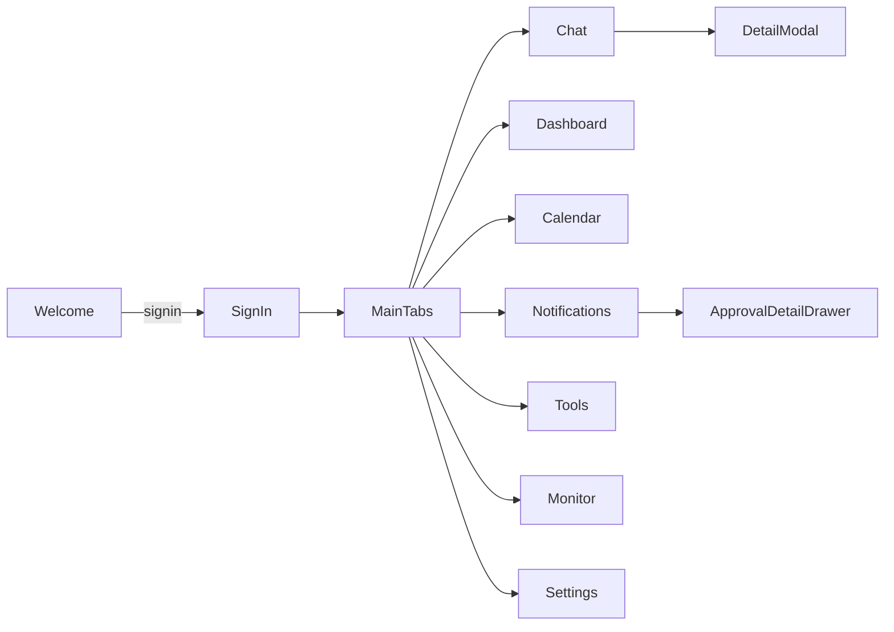

# CCOPINAI – Page & Navigation Spec

*Generated 2025-07-06*

---

## Navigation Shell

```text
AuthStack  -->  MainTabs
                ├─ Chat
                ├─ Dashboard
                ├─ Calendar
                ├─ Notifications
                ├─ Tools        <── new
                └─ Monitor      <── new
                └─ Settings
```

Implemented with **react-navigation v7** (native stack + bottom tabs).

---

## 1 AuthStack

| Screen | Components | Core Functions | Navigation |
|--------|------------|----------------|------------|
| **Welcome** | Logo, "Get Started" btn | `navigate('SignIn')` | ─ |
| **SignIn** | TextInput(email, pwd), Submit btn, SocialLogin | `supabase.auth.signIn()` | → MainTabs |
| **SignUp** | TextInput, pwd strength bar, T&C checkbox | `supabase.auth.signUp()` | → VerifyEmail |
| **VerifyEmail** | CodeInput, Resend link | `supabase.auth.verifyOtp()` | → MainTabs |
| **ForgotPassword** | Email input | `supabase.auth.reset()` | ← SignIn |

---

## 2 MainTabs

### 2.1 Chat

- **TranscriptList** (FlatList)
- **TranscriptCard** – title, snippet, action chips
- **ChatInput** – voice/text toggle, send button
- **ActionChips** – quick prompts ("Summarize", "Tasks")

Functions:  
`fetchMessages()`, `sendMessage()`, `streamAI()`

Navigation:  
TranscriptCard → **DetailModal**

---

### 2.2 Dashboard

- **KPICards** – Freshness, Pending Approvals, Tasks Due
- **QuickActions** – New Note, Start Recording, Upload File
- **RecentActivity** – timeline

Functions: `fetchMetrics()`, `refreshPull()`

Navigation: QuickAction → target screen (e.g., Chat, Calendar)

---

### 2.3 Calendar

- **AgendaView** (week/month)
- **EventItem** – color-coded by status
- **EventDetailSheet** – bottom sheet with approve/deny/reschedule

Functions: `fetchEvents()`, `createEvent()`, `updateEvent()`, `deleteEvent()`

Navigation: FAB → **NewEventForm**

---

### 2.4 Notifications

- **ApprovalCard** – Accept / Deny swipe actions
- **AlertCard** – info / warning / error badges
- **FilterBar** – Pending • Completed • All

Functions: `approveAction()`, `denyAction()`, `markRead()`

Navigation: ApprovalCard → **ApprovalDetailDrawer**

---

### 2.5 Tools (ToolsTab)

#### 6.1 ToolList

| Component | Purpose |
|-----------|---------|
| **ToolCard** | Icon, name, version, toggle, OAuth status badge |
| **AddIntegrationFAB** | Opens IntegrationWizard |

Functions: `fetchTools()`, `toggleTool(id)`, `openWizard(provider)`

Navigation: ToolCard → **ToolDetail**

#### 6.2 ToolDetail

Tabs: *Settings • Triggers • Logs*

- **SettingsTab** – default params form (React-Hook-Form)
- **TriggersTab** – TriggerRuleTable (regex / vector threshold / geo)
- **LogsTab** – last 20 executions (status chip, timestamp)

Functions: `updateParams()`, `addTrigger()`, `testRun()`

#### 6.3 IntegrationWizard (ModalStack)

Steps: Provider select → OAuth WebView → ScopePicker → Confirm.

---

### 2.6 Monitor (MonitorTab)

#### 7.1 ProcessingTable

Columns: Meeting, Stage, Status, Tool, Started, Duration.

Row badges color-coded by stage:

*Ingested → Vectorized → Parsed → Proposed → Approved • Executed • Indexed*

#### 7.2 LogDrawer

Slide-over drawer shows full `processing_logs` for selected row, payload pretty-printed.

Actions: **Retry**, **Force Execute**, **Copy JSON**.

#### 7.3 StageTimeline (DetailModal)

Graphical timeline (VictoryChart) with event dots and durations.

---

### 2.7 Settings

- **ProfileForm** – name, avatar, timezone
- **ThemeSwitcher** – dark / light / system
- **IntegrationList** – GCal, Gmail, Slack, Odoo
- **DangerZone** – delete account

Functions: `updateProfile()`, `connectOAuth()`, `disconnectIntegration()`

Navigation: IntegrationItem → **OAuthWebView**

---

## 3 Modal / Portal Screens

| Modal | Purpose |
|-------|---------|
| **ApprovalModal** | Immediate approve/deny with diff view |
| **LocationPermissionSheet** | Request foreground & background location |
| **MediaPickerSheet** | Attach image / video / file |
| **DetailModal** | Full transcript & AI summary |
| **NewEventForm** | Create calendar event or recurring rule |
| **ApprovalDetailDrawer** | Execution payload, change schedule |

---

## 4 Background Services

| Service | Platform | Duty |
|---------|----------|------|
| **SyncService** | JS + expo-task-manager | Poll Limitless, post NATS heartbeat |
| **PushService** | expo-notifications | Receive & route push |
| **LocationService** | expo-location | Foreground geofence publish |
| **AudioRecorder** | expo-audio | Continuous capture (opt-in) |

---

## 5 Global Stores (Zustand)

- **authStore** – session, user profile
- **themeStore** – current theme, system override
- **chatStore** – messages, streaming status
- **notifStore** – pending approvals, alerts
- **settingsStore** – integration tokens, feature flags
- **toolStore** – list, enabled state, default params
- **monitorStore** – live events (supabase channel buffer)

---

## 6 Utility Hooks

- `useRealtime(channel)` – Supabase live data
- `useGeofence()` – subscribe to location triggers
- `useApproval(actionId)` – approval workflow helper
- `useEmbeddingsSearch(query)` – semantic search wrapper
- `useTool(id)` – CRUD helpers
- `useProcessingEvents()` – subscribe, filter

---

## 7 Navigation Flow



---

## Permissions Matrix

| Role | ToolsTab | MonitorTab |
|------|----------|------------|
| User | read / write own | view own items |
| Admin | manage all | retry / force any |

---

**End of Spec**
